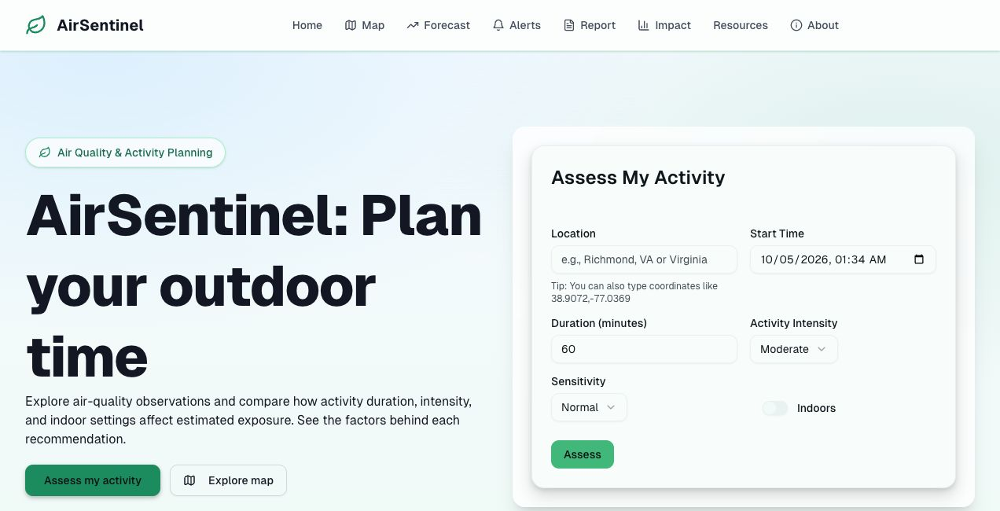
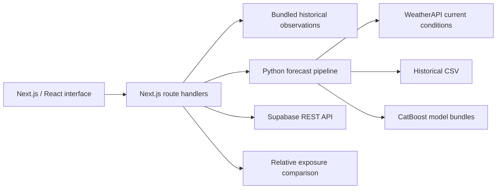

# AirSentinel

**Air-quality exploration and activity exposure planning.**

[](https://github.com/amohantycode/AirSentinel/actions/workflows/ci.yml)
[](LICENSE)

AirSentinel is a team-built air-quality application that brings together location-based observations, pollutant forecasting, and activity-specific exposure estimates. It explores a practical question: **how might changing the timing, duration, or setting of an outdoor activity change exposure?**

Built with **Next.js · TypeScript · React · Python · CatBoost · Supabase**.

[Quick start](#quick-start) · [Architecture](docs/architecture.md) · [API reference](docs/api.md) · [Development](docs/development.md)



*Local application preview. Live assessments require the forecast setup below.*

## What it does

| Capability | Implementation | Setup needed |
| --- | --- | --- |
| Explore monitoring locations | Searchable map with AQI cards and bundled 2025 observations | Runs locally without credentials; Google Maps is optional |
| Check current conditions | Server-side WeatherAPI integration for PM2.5, ozone, and NO₂ | WeatherAPI key and Python dependencies |
| Forecast pollutant levels | Python pipeline combining recent observations, historical features, and seven-day models | Historical CSV and trained model bundles, supplied separately |
| Compare activity plans | Relative exposure estimates for keeping, delaying, shortening, or moving a plan indoors | Working forecast pipeline |
| Explore trends and community features | Historical dashboard, reports, and alert subscription forms | Historical data and/or optional Supabase setup |

**Project status:** a functional web prototype with optional data integrations. The repository includes historical observations and model metadata, but **does not include the historical training CSV or the seven-day model bundles**. The local map is the quickest way to explore the included data. Forecasting requires the additional assets described below. Alert subscription storage is implemented; a scheduled email delivery service is not included.

## Quick start

Use **Node.js 22** and npm. Python is only needed for current conditions, forecasting, and data scripts.

```bash
git clone https://github.com/amohantycode/AirSentinel.git
cd AirSentinel
npm ci
cp .env.example .env.local
npm run dev
```

Open [localhost:3000/map](http://localhost:3000/map) to explore the bundled monitoring locations. Without a Google Maps key, the app uses its built-in SVG map. These observations are historical snapshots, not live readings.

The application shell, informational pages, and bundled observations work without API keys. Live conditions, assessments, and external services need the corresponding configuration.

### Enable current conditions and forecasting

```bash
python3 -m venv venv
source venv/bin/activate
python -m pip install -r requirements-ml.txt
```

Set `WEATHER_API_KEY` in `.env.local`, then restart the development server. Current conditions can run with the key and Python dependencies alone. Forecasting additionally expects:

```text
data/combined-historical-2020-2025.csv
models/daily_7d/pm25_7d.joblib
models/daily_7d/ozone_7d.joblib
models/daily_7d/no2_7d.joblib
```

Only load model files from a trusted source. The existing `aqi_model_*.pkl` files are separate artifacts and are not substitutes for these forecast bundles. See [data and model setup](docs/development.md#data-and-model-setup) for the expected inputs and training entry point.

### Configuration

| Variable | Purpose |
| --- | --- |
| `WEATHER_API_KEY` | Server-side WeatherAPI access for current conditions and forecasts |
| `NEXT_PUBLIC_GOOGLE_MAPS_API_KEY` | Optional interactive Google Maps; restrict to your allowed origins |
| `NEXT_PUBLIC_SUPABASE_URL` | Optional database project URL |
| `NEXT_PUBLIC_SUPABASE_ANON_KEY` | Optional public database key; access depends on row-level policies |

Leave unused values blank. Do not commit `.env.local`. See [development notes](docs/development.md) before configuring database writes or deploying.

## Architecture



- **Typed application layer:** TypeScript components, API routes, and shared observation types.
- **Separate forecast pipeline:** Python owns feature construction and model inference; route handlers return JSON to the interface.
- **Inspectable recommendations:** activity duration, intensity, sensitivity, and indoor assumptions contribute to a relative exposure score.
- **Optional integrations:** the bundled observation path works independently of WeatherAPI, Google Maps, and Supabase.

See [architecture and tradeoffs](docs/architecture.md) for request flows, fallback behavior, and limitations.

## Verify locally

```bash
npm run check       # ESLint and TypeScript
npm run build       # Production build with checks enabled
npm test            # HTTP smoke tests against the production build
```

Tests run without API credentials and cover public pages, bundled observation responses, filtering, and selected error paths. They do not validate model accuracy or external integrations. GitHub Actions runs the same checks on pushes and pull requests.

## Repository guide

| Path | Responsibility |
| --- | --- |
| [`app/`](app/) | Pages and HTTP route handlers |
| [`components/`](components/) | Map, charts, forms, and shared UI |
| [`lib/`](lib/) | Types, AQI helpers, and integration configuration |
| [`scripts/`](scripts/) | Python ingestion/inference/training and SQL setup |
| [`models/`](models/) | Existing model artifacts and forecast metadata |
| [`public/`](public/) | Bundled observation snapshots and static assets |
| [`tests/`](tests/) | Production HTTP smoke tests |
| [`docs/`](docs/) | Architecture, API contracts, and setup details |

## Model scope and next steps

The exposure score is a heuristic in relative units, not a measured inhaled dose. The current implementation includes fixed assumptions for indoor exposure, a one-hour delay, and uncertainty bands. Hourly estimates may use a constructed daily profile when provider data is unavailable. No clinical validation or forecast accuracy claim is made here.

Priority follow-up work is to restore versioned forecast assets, publish reproducible evaluation results, improve validation and data-source labeling, and replace synchronous Python execution with an asynchronous inference service. See the [documented limitations](docs/architecture.md#limitations-and-next-steps).

## Team and license

AirSentinel was developed as a team project. This repository documents the shared application; it does not assign individual contributions.

Licensed under the [MIT License](LICENSE). Existing copyright notices are preserved.
